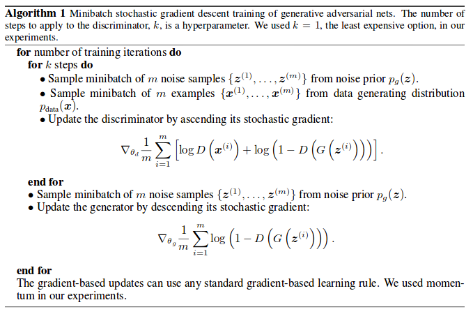
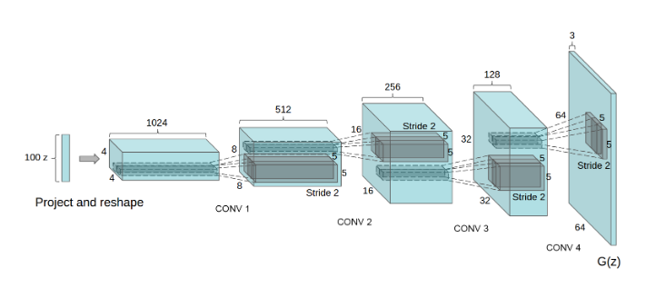

# GAN-papers

## Baseline
- [Generative Adversarial Nets](http://papers.nips.cc/paper/5423-generative-adversarial-nets.pdf)
  - 始まり。GeneratorとDiscriminatorという２つのネットワークを学習させて、Generatorから対象物を生成するアイデア  
  
- [Unsupervised Representation Learning With Deep Convolutional Generative Adversarial Networks](https://arxiv.org/pdf/1511.06434.pdf%C3%AF%C2%BC%E2%80%B0) -> [code](https://github.com/SerialLain3170/Illustration-Generator/tree/master/DCGAN)
  - DCGAN。Batch Normalizationを用いる、GeneratorにはLeaky-ReLUを用いる等GANを学習させるテクニックを駆使している。
  - ただし、高解像度にはmode collapse(同一画像を生成するようになる)が起きたり、学習の収束が安定しなかったり等問題は山積み。  
  
  
  これ以上はIssueを立てていくので、[Issue](https://github.com/SerialLain3170/GAN-papers/issues)を参照してください。
